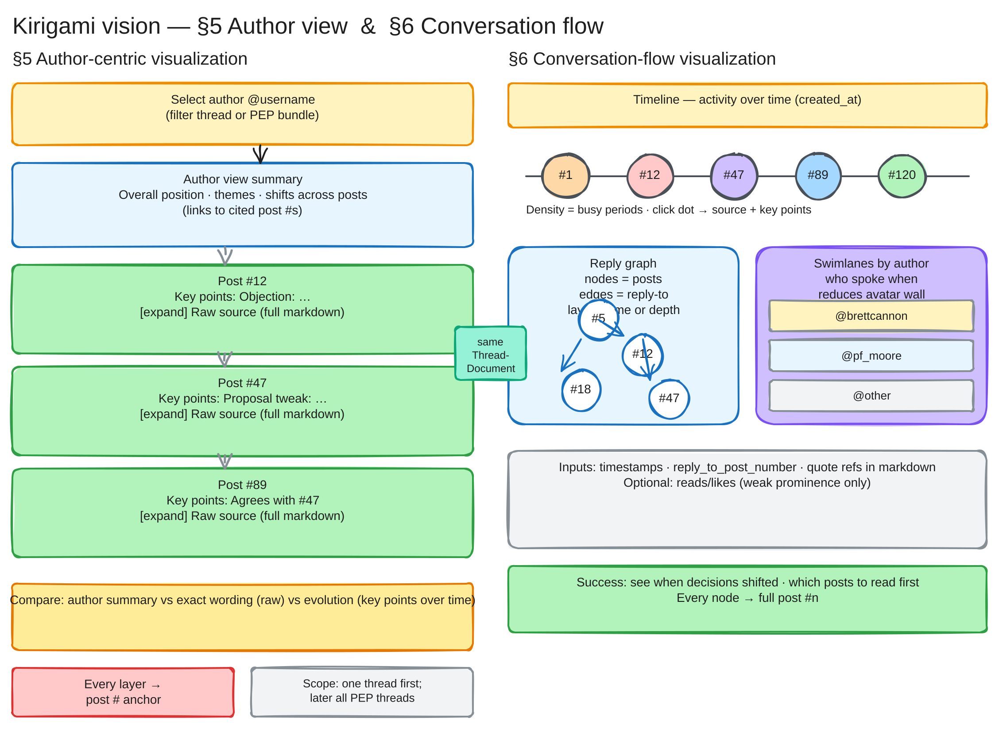

# Author and conversation-flow diagram

Detail view of [vision](vision.md) §5 (author-centric visualization) and §6 (conversation-flow visualization): how a reader studies one voice in a thread and how time and reply structure are made visible.

## Reading the diagram

### Left — §5 Author-centric visualization

- **Yellow** — Select an author (`@username`) for one thread or a PEP bundle.
- **Blue** — Author-level summary of position and themes across posts.
- **Green rows** — Each post: key points plus expandable raw source.
- **Amber** — Compare summary, exact wording, and evolution over time.
- **Red** — Every layer links to a post number.

### Right — §6 Conversation-flow visualization

- **Yellow** — Timeline of activity (`created_at`).
- **Blue** — Reply graph: posts as nodes, reply-to as edges.
- **Purple** — Swimlanes by author.
- **Gray** — Inputs (timestamps, `reply_to_post_number`, quotes).
- **Green** — Success: find when the thread shifted; open full post #*n* from any node.

The teal **ThreadDocument** bridge connects both sides to the shared archive of source posts.

See the [color legend](diagrams.md) for full semantics.

## Source file

Editable Excalidraw source: [kirigami-vision-author-flow.excalidraw](kirigami-vision-author-flow.excalidraw).
