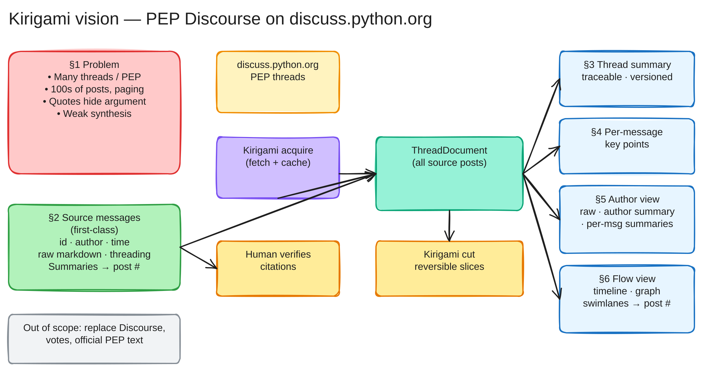

# Vision overview diagram

End-to-end view of the [kirigami vision](vision.md): the problem with long PEP threads on Discourse, the source-first principle, ingestion into a `ThreadDocument`, and derived views (thread summary, per-message key points, author view, and flow view).

## Reading the diagram

| Region | Vision section |
|--------|----------------|
| Red (left) | §1 — Problem: scale, fragmentation, weak synthesis |
| Green (below) | §2 — Source messages remain first-class |
| Yellow → purple → teal (center) | Discourse → acquire → `ThreadDocument` |
| Blue (right) | §3–§6 — Derived summaries and visualizations |
| Amber (bottom) | Human verification and kirigami “cut” |
| Gray | Out of scope |

See the [color legend](diagrams.md) for fill/stroke hex codes and arrow meanings.

## Source file

Editable Excalidraw source: [kirigami-vision.excalidraw](kirigami-vision.excalidraw).
